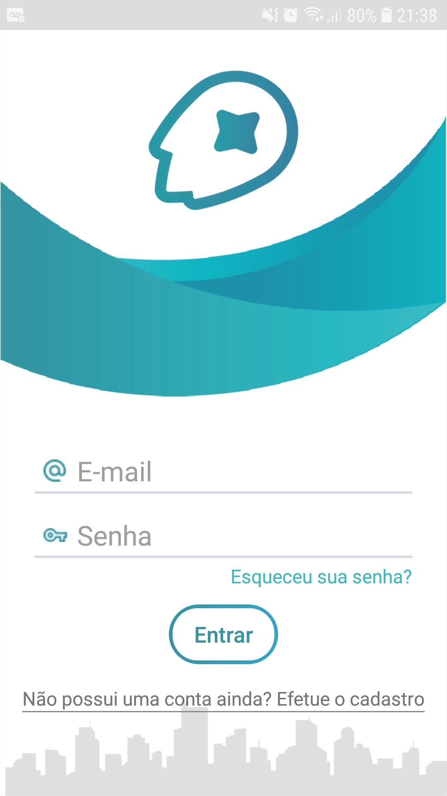
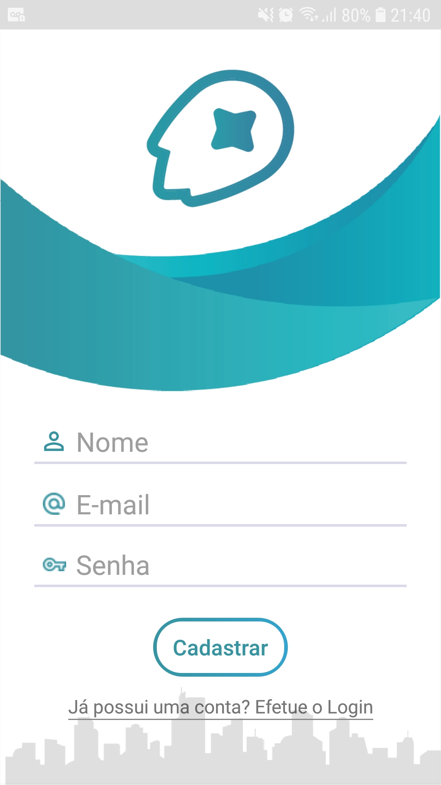
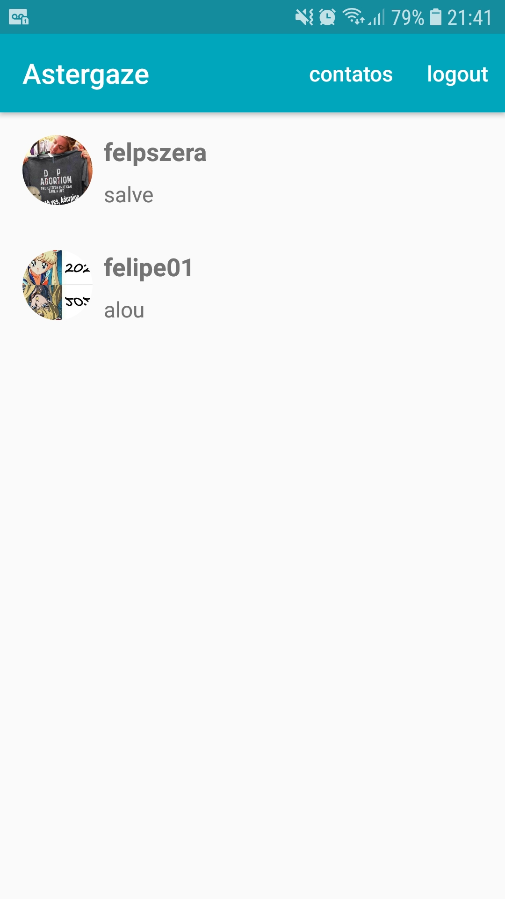
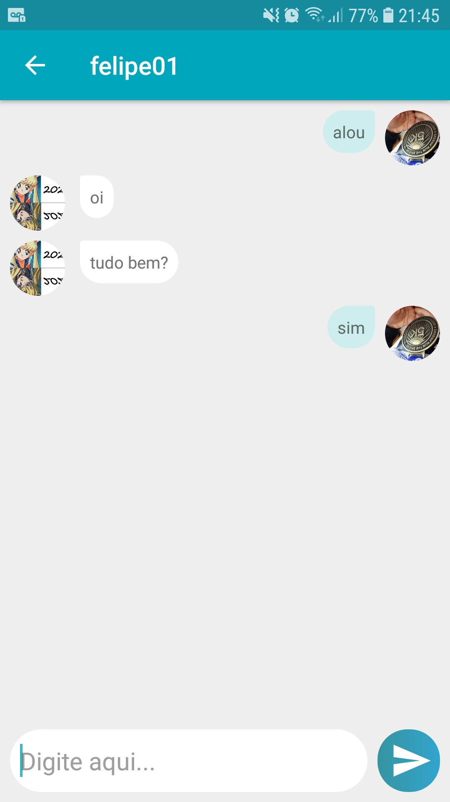

<!-- Improved compatibility of back to top link: See: https://github.com/othneildrew/Best-README-Template/pull/73 -->
<a name="readme-top"></a>
<!--
*** Thanks for checking out the Best-README-Template. If you have a suggestion
*** that would make this better, please fork the repo and create a pull request
*** or simply open an issue with the tag "enhancement".
*** Don't forget to give the project a star!
*** Thanks again! Now go create something AMAZING! :D
-->


<!-- PROJECT SHIELDS -->
<!--
*** I'm using markdown "reference style" links for readability.
*** Reference links are enclosed in brackets [ ] instead of parentheses ( ).
*** See the bottom of this document for the declaration of the reference variables
*** for contributors-url, forks-url, etc. This is an optional, concise syntax you may use.
*** https://www.markdownguide.org/basic-syntax/#reference-style-links
-->
[![Contributors][contributors-shield]][contributors-url]
[![Forks][forks-shield]][forks-url]
[![Stargazers][stars-shield]][stars-url]
[![Issues][issues-shield]][issues-url]
[![MIT License][license-shield]][license-url]
[![LinkedIn][linkedin-shield]][linkedin-url]


<!-- PROJECT LOGO -->
<br />
<div align="center">
  <a href="https://github.com/felmateos/astergaze">
    
  </a>

<h3 align="center">Astergaze</h3>

  <p align="center">
    Astergaze é um aplicativo mobile para dispositivos Android, cuja função é permitir que seus usuários se comuniquem por meio de mensagens de texto e emojis.
    <br />
    <a href="https://github.com/felmateos/astergaze"><strong>Explore a documentação »</strong></a>
    <br />
    <br />
    <a href="https://github.com/felmateos/astergaze">Ver demo</a>
    ·
    <a href="https://github.com/felmateos/astergaze/issues">Reportar Bug</a>
    ·
    <a href="https://github.com/felmateos/astergaze/issues">Exigir feature</a>
  </p>
</div>


<!-- TABLE OF CONTENTS -->
<details>
  <summary>Conteúdos</summary>
  <ol>
    <li>
      <a href="#sobre-o-projeto">Sobre o projeto</a>
    </li>
    <li>
      <a href="#iniciando">Iniciando</a>
      <ul>
        <li><a href="#pre-requisitos">Pré-requisitos</a></li>
        <li><a href="#como-instalar">Como instalar</a></li>
      </ul>
    </li>
    <li><a href="#licensa">Licensa</a></li>
    <li><a href="#contato">Contato</a></li>
  </ol>
</details>


<!-- ABOUT THE PROJECT -->
## Sobre o Projeto

<div style="float: left">






</div>

Here's a blank template to get started: To avoid retyping too much info. Do a search and replace with your text editor for the following: `github_username`, `repo_name`, `twitter_handle`, `linkedin_username`, `email_client`, `email`, `project_title`, `project_description`

<p align="right">(<a href="#readme-top">back to top</a>)</p>


<!-- GETTING STARTED -->
## Iniciando

Como baixar e contribuir com o projeto.

### Pre-requisitos

* Android Studio

### Como instalar

1. Baixe o Android Studio em: https://developer.android.com/studio
2. Clone o repositório
   ```sh
   git clone https://github.com/felmateos/astergaze.git
   ```

<p align="right">(<a href="#readme-top">back to top</a>)</p>

<!-- LICENSE -->
## Licensa

Distributed under the MIT License. See `LICENSE.txt` for more information.

<p align="right">(<a href="#readme-top">back to top</a>)</p>


<!-- CONTACT -->
## Contato

Felmateos - https://linkedin.com/in/felmateos - felmateos@usp.br

Project Link: [https://github.com/felmateos/astergaze](https://github.com/felmateos/astergaze)

<p align="right">(<a href="#readme-top">back to top</a>)</p>

<!-- MARKDOWN LINKS & IMAGES -->
<!-- https://www.markdownguide.org/basic-syntax/#reference-style-links -->
[contributors-shield]: https://img.shields.io/github/contributors/felmateos/astergaze.svg?style=for-the-badge
[contributors-url]: https://github.com/felmateos/astergaze/graphs/contributors
[forks-shield]: https://img.shields.io/github/forks/felmateos/astergaze.svg?style=for-the-badge
[forks-url]: https://github.com/felmateos/astergaze/network/members
[stars-shield]: https://img.shields.io/github/stars/felmateos/astergaze.svg?style=for-the-badge
[stars-url]: https://github.com/felmateos/astergaze/stargazers
[issues-shield]: https://img.shields.io/github/issues/felmateos/astergaze.svg?style=for-the-badge
[issues-url]: https://github.com/felmateos/astergaze/issues
[license-shield]: https://img.shields.io/github/license/felmateos/astergaze.svg?style=for-the-badge
[license-url]: https://github.com/felmateos/astergaze/blob/master/LICENSE.txt
[linkedin-shield]: https://img.shields.io/badge/-LinkedIn-black.svg?style=for-the-badge&logo=linkedin&colorB=259
[linkedin-url]: https://linkedin.com/in/felmateos
[login-screenshot]: app/src/main/res/screenshots/Login.jpg
[signin-screenshot]: app/src/main/res/screenshots/Signin.jpg
[contacts-screenshot]: app/src/main/res/screenshots/Contacts.jpg
[chat-screenshot]: app/src/main/res/screenshots/Chat.jpg

